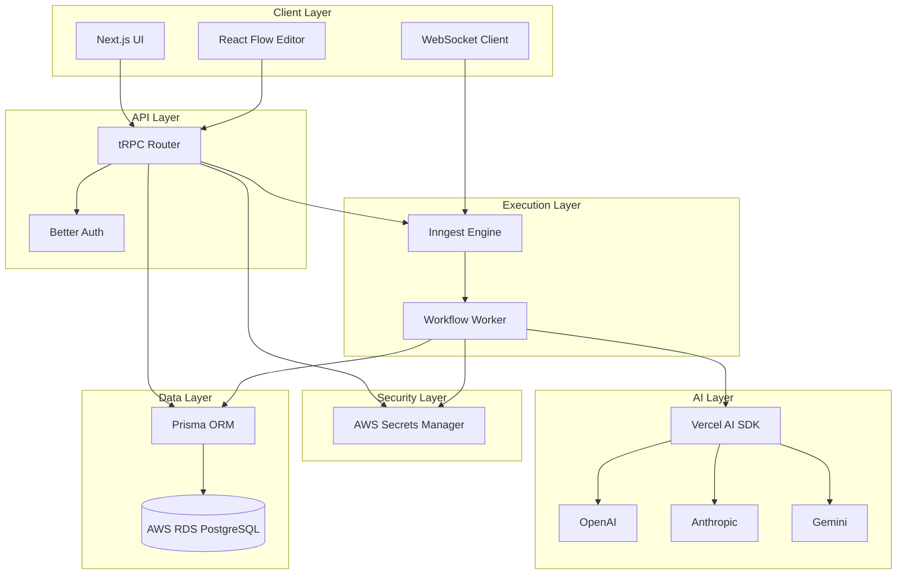
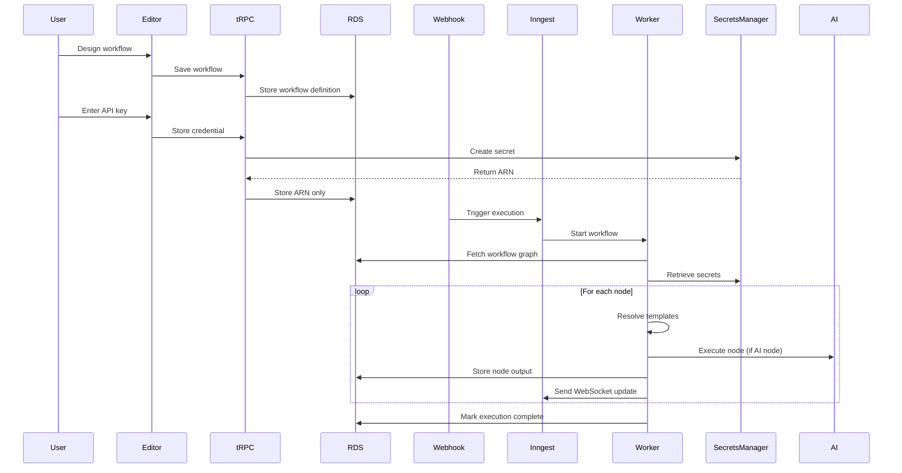

# Design Document: WorkFuse

## Overview

WorkFuse is an AI-native workflow automation platform built on AWS with a modern TypeScript stack. The architecture follows a three-phase model: Design (visual workflow creation), Storage (secure credential management), and Execution (durable workflow processing).

The system is composed of:
- **Frontend Layer**: Next.js application with React Flow for visual editing, Jotai for state management, and WebSocket for real-time updates
- **API Layer**: tRPC endpoints for type-safe client-server communication
- **Data Layer**: Prisma ORM with PostgreSQL (AWS RDS) for workflow definitions and execution history
- **Security Layer**: AWS Secrets Manager for credential storage, Better Auth for authentication
- **Execution Layer**: Inngest for durable workflow orchestration with no timeout limits
- **AI Layer**: Vercel AI SDK for multi-provider LLM integration (OpenAI, Anthropic, Gemini)

The design prioritizes security (zero-trust credential model), reliability (durable execution with retries), and developer experience (AI-powered configuration, real-time observability).

## Architecture

### System Architecture Diagram



### Execution Flow



## Components and Interfaces

### 1. Workflow Editor Component

**Responsibility**: Visual workflow design interface using React Flow

**Key Interfaces**:

```typescript
interface WorkflowGraph {
  id: string;
  name: string;
  nodes: WorkflowNode[];
  edges: WorkflowEdge[];
  version: number;
  createdAt: Date;
  updatedAt: Date;
}

interface WorkflowNode {
  id: string;
  type: NodeType;
  position: { x: number; y: number };
  data: NodeConfiguration;
}

interface WorkflowEdge {
  id: string;
  source: string;
  target: string;
  sourceHandle?: string;
  targetHandle?: string;
}

type NodeType = 'http' | 'transform' | 'condition' | 'ai' | 'trigger';

interface NodeConfiguration {
  label: string;
  config: Record<string, unknown>;
  retryPolicy?: RetryPolicy;
}

interface RetryPolicy {
  maxAttempts: number;
  backoffMultiplier: number;
  initialDelayMs: number;
}
```

**Operations**:
- `addNode(type: NodeType, position: Position): WorkflowNode`
- `deleteNode(nodeId: string): void`
- `addEdge(source: string, target: string): WorkflowEdge`
- `deleteEdge(edgeId: string): void`
- `updateNodeConfig(nodeId: string, config: NodeConfiguration): void`
- `validateGraph(graph: WorkflowGraph): ValidationResult`
- `saveWorkflow(graph: WorkflowGraph): Promise<void>`
- `loadWorkflow(workflowId: string): Promise<WorkflowGraph>`

**Validation Rules**:
- Graph must be a directed acyclic graph (DAG)
- All edges must connect existing nodes
- Each workflow must have exactly one trigger node
- Node configurations must match their type schema

### 2. Magic Input Component

**Responsibility**: AI-powered conversion of plain English to node configuration

**Key Interfaces**:

```typescript
interface MagicInputRequest {
  prompt: string;
  nodeType: NodeType;
  provider: AIProvider;
  context?: Record<string, unknown>;
}

interface MagicInputResponse {
  config: NodeConfiguration;
  confidence: number;
  reasoning?: string;
}

type AIProvider = 'openai' | 'anthropic' | 'gemini';

interface AIProviderConfig {
  provider: AIProvider;
  model: string;
  temperature: number;
  maxTokens: number;
}
```

**Operations**:
- `generateConfig(request: MagicInputRequest): Promise<MagicInputResponse>`
- `validateGeneratedConfig(config: NodeConfiguration, schema: JSONSchema): ValidationResult`
- `retryWithFeedback(request: MagicInputRequest, error: string, attempt: number): Promise<MagicInputResponse>`

**AI Prompt Strategy**:
- System prompt includes node type schema and examples
- User prompt includes plain English description and available context
- Response format enforced via JSON schema mode
- Retry mechanism includes previous error in context

### 3. Secret Manager Service

**Responsibility**: Secure credential storage and retrieval via AWS Secrets Manager

**Key Interfaces**:

```typescript
interface SecretReference {
  arn: string;
  name: string;
  createdAt: Date;
}

interface SecretValue {
  value: string;
  metadata?: Record<string, string>;
}

interface CreateSecretRequest {
  name: string;
  value: string;
  description?: string;
  tags?: Record<string, string>;
}
```

**Operations**:
- `createSecret(request: CreateSecretRequest): Promise<SecretReference>`
- `getSecretValue(arn: string): Promise<SecretValue>`
- `deleteSecret(arn: string): Promise<void>`
- `rotateSecret(arn: string, newValue: string): Promise<void>`

**Security Considerations**:
- All secrets encrypted at rest by AWS
- TLS for all API calls to Secrets Manager
- IAM role-based access control
- Secrets never logged or stored in application database
- Automatic secret rotation support

### 4. Execution Engine (Inngest Integration)

**Responsibility**: Durable workflow execution with state persistence

**Key Interfaces**:

```typescript
interface ExecutionContext {
  executionId: string;
  workflowId: string;
  trigger: TriggerPayload;
  nodeOutputs: Map<string, unknown>;
  secrets: Map<string, string>;
  startedAt: Date;
  status: ExecutionStatus;
}

type ExecutionStatus = 'pending' | 'running' | 'completed' | 'failed' | 'retrying';

interface TriggerPayload {
  source: string;
  data: Record<string, unknown>;
  headers?: Record<string, string>;
}

interface NodeExecutionResult {
  nodeId: string;
  status: 'success' | 'failure';
  output?: unknown;
  error?: ExecutionError;
  duration: number;
}

interface ExecutionError {
  message: string;
  code: string;
  stack?: string;
  retryable: boolean;
}
```

**Operations**:
- `startExecution(workflowId: string, trigger: TriggerPayload): Promise<string>`
- `executeNode(node: WorkflowNode, context: ExecutionContext): Promise<NodeExecutionResult>`
- `resolveTemplates(config: NodeConfiguration, context: ExecutionContext): NodeConfiguration`
- `retryNode(node: WorkflowNode, context: ExecutionContext, attempt: number): Promise<NodeExecutionResult>`
- `sendWebSocketUpdate(executionId: string, update: ExecutionUpdate): Promise<void>`

**Execution Algorithm**:
1. Fetch workflow graph from database
2. Perform topological sort to determine execution order
3. Retrieve all required secrets from AWS Secrets Manager
4. For each node in order:
   - Resolve template expressions using previous outputs
   - Execute node logic (HTTP call, transformation, AI request, etc.)
   - Store output in execution context
   - Send WebSocket update to client
   - If failure and retries configured, apply retry policy
5. Mark execution as completed or failed
6. Store final execution state in database

### 5. Template Engine

**Responsibility**: Dynamic data interpolation using Handlebars

**Key Interfaces**:

```typescript
interface TemplateContext {
  nodes: Record<string, unknown>;
  trigger: Record<string, unknown>;
  env: Record<string, string>;
}

interface TemplateHelpers {
  formatDate(date: string, format: string): string;
  jsonParse(json: string): unknown;
  jsonStringify(obj: unknown): string;
  uppercase(str: string): string;
  lowercase(str: string): string;
  get(obj: unknown, path: string): unknown;
}
```

**Operations**:
- `compile(template: string): CompiledTemplate`
- `render(template: CompiledTemplate, context: TemplateContext): string`
- `registerHelper(name: string, fn: Function): void`
- `validateTemplate(template: string): ValidationResult`

**Template Syntax**:
- Variable access: `{{nodes.node1.response.data}}`
- Nested access: `{{nodes.node1.user.email}}`
- Helper functions: `{{formatDate trigger.timestamp "YYYY-MM-DD"}}`
- Conditionals: `{{#if nodes.node1.success}}...{{/if}}`

### 6. Node Executors

**Responsibility**: Type-specific node execution logic

#### HTTP Node Executor

```typescript
interface HTTPNodeConfig {
  method: 'GET' | 'POST' | 'PUT' | 'DELETE' | 'PATCH';
  url: string;
  headers?: Record<string, string>;
  body?: unknown;
  auth?: {
    type: 'bearer' | 'basic' | 'apiKey';
    secretArn: string;
  };
  timeout?: number;
}

interface HTTPNodeOutput {
  status: number;
  headers: Record<string, string>;
  body: unknown;
  duration: number;
}
```

**Operations**:
- `execute(config: HTTPNodeConfig, context: ExecutionContext): Promise<HTTPNodeOutput>`
- `buildRequest(config: HTTPNodeConfig, secrets: Map<string, string>): Request`
- `handleResponse(response: Response): HTTPNodeOutput`

#### Transform Node Executor

```typescript
interface TransformNodeConfig {
  language: 'javascript' | 'jsonata';
  code: string;
  timeout?: number;
}

interface TransformNodeOutput {
  result: unknown;
  logs?: string[];
}
```

**Operations**:
- `execute(config: TransformNodeConfig, context: ExecutionContext): Promise<TransformNodeOutput>`
- `createSandbox(context: ExecutionContext): Sandbox`
- `runInSandbox(code: string, sandbox: Sandbox): unknown`

#### AI Node Executor

```typescript
interface AINodeConfig {
  provider: AIProvider;
  model: string;
  prompt: string;
  systemPrompt?: string;
  temperature?: number;
  maxTokens?: number;
  stream?: boolean;
}

interface AINodeOutput {
  response: string;
  usage: {
    promptTokens: number;
    completionTokens: number;
    totalTokens: number;
  };
  model: string;
  finishReason: string;
}
```

**Operations**:
- `execute(config: AINodeConfig, context: ExecutionContext): Promise<AINodeOutput>`
- `streamResponse(config: AINodeConfig, context: ExecutionContext): AsyncIterator<string>`

#### Condition Node Executor

```typescript
interface ConditionNodeConfig {
  conditions: ConditionRule[];
  defaultBranch: string;
}

interface ConditionRule {
  field: string;
  operator: 'eq' | 'ne' | 'gt' | 'lt' | 'contains' | 'matches';
  value: unknown;
  branch: string;
}

interface ConditionNodeOutput {
  branch: string;
  matchedRule?: number;
}
```

**Operations**:
- `execute(config: ConditionNodeConfig, context: ExecutionContext): Promise<ConditionNodeOutput>`
- `evaluateCondition(rule: ConditionRule, context: ExecutionContext): boolean`

### 7. tRPC API Router

**Responsibility**: Type-safe API endpoints for client-server communication

**Key Procedures**:

```typescript
// Workflow procedures
workflows.create(input: CreateWorkflowInput): Promise<Workflow>
workflows.update(input: UpdateWorkflowInput): Promise<Workflow>
workflows.delete(workflowId: string): Promise<void>
workflows.get(workflowId: string): Promise<Workflow>
workflows.list(): Promise<Workflow[]>
workflows.export(workflowId: string): Promise<WorkflowExport>
workflows.import(data: WorkflowExport): Promise<Workflow>

// Execution procedures
executions.trigger(workflowId: string, payload: TriggerPayload): Promise<string>
executions.get(executionId: string): Promise<Execution>
executions.list(workflowId: string, filters: ExecutionFilters): Promise<Execution[]>
executions.retry(executionId: string): Promise<string>
executions.cancel(executionId: string): Promise<void>

// Secret procedures
secrets.create(input: CreateSecretInput): Promise<SecretReference>
secrets.delete(arn: string): Promise<void>
secrets.list(): Promise<SecretReference[]>

// AI procedures
ai.generateConfig(input: MagicInputRequest): Promise<MagicInputResponse>
ai.testPrompt(input: TestPromptInput): Promise<AINodeOutput>
```

**Middleware**:
- Authentication: Validate session token on all requests
- Authorization: Verify user owns requested resources
- Rate limiting: Prevent abuse of AI endpoints
- Error handling: Transform errors to client-friendly format
- Logging: Record all API calls with timing

### 8. WebSocket Manager

**Responsibility**: Real-time execution updates to connected clients

**Key Interfaces**:

```typescript
interface ExecutionUpdate {
  executionId: string;
  type: UpdateType;
  nodeId?: string;
  data: unknown;
  timestamp: Date;
}

type UpdateType = 'started' | 'node_started' | 'node_completed' | 'node_failed' | 'completed' | 'failed';

interface WebSocketConnection {
  connectionId: string;
  userId: string;
  executionId: string;
  connectedAt: Date;
}
```

**Operations**:
- `connect(userId: string, executionId: string): Promise<string>`
- `disconnect(connectionId: string): Promise<void>`
- `sendUpdate(executionId: string, update: ExecutionUpdate): Promise<void>`
- `broadcast(userIds: string[], update: ExecutionUpdate): Promise<void>`

**Connection Management**:
- Authenticate WebSocket connections using session token
- Track active connections per execution
- Handle reconnection with execution state sync
- Clean up stale connections after timeout

## Data Models

### Database Schema (Prisma)

```prisma
model User {
  id        String   @id @default(cuid())
  email     String   @unique
  name      String?
  createdAt DateTime @default(now())
  updatedAt DateTime @updatedAt
  
  workflows  Workflow[]
  executions Execution[]
  sessions   Session[]
}

model Workflow {
  id          String   @id @default(cuid())
  name        String
  description String?
  graph       Json     // WorkflowGraph
  version     Int      @default(1)
  webhookUrl  String   @unique
  isActive    Boolean  @default(true)
  createdAt   DateTime @default(now())
  updatedAt   DateTime @updatedAt
  
  userId      String
  user        User     @relation(fields: [userId], references: [id], onDelete: Cascade)
  
  executions  Execution[]
  versions    WorkflowVersion[]
  secrets     SecretReference[]
  
  @@index([userId])
  @@index([webhookUrl])
}

model WorkflowVersion {
  id         String   @id @default(cuid())
  version    Int
  graph      Json
  createdAt  DateTime @default(now())
  
  workflowId String
  workflow   Workflow @relation(fields: [workflowId], references: [id], onDelete: Cascade)
  
  @@unique([workflowId, version])
  @@index([workflowId])
}

model Execution {
  id          String          @id @default(cuid())
  status      ExecutionStatus
  triggerData Json
  nodeResults Json            // Map<nodeId, NodeExecutionResult>
  error       String?
  startedAt   DateTime        @default(now())
  completedAt DateTime?
  duration    Int?            // milliseconds
  
  workflowId  String
  workflow    Workflow        @relation(fields: [workflowId], references: [id], onDelete: Cascade)
  
  userId      String
  user        User            @relation(fields: [userId], references: [id], onDelete: Cascade)
  
  logs        ExecutionLog[]
  
  @@index([workflowId])
  @@index([userId])
  @@index([status])
  @@index([startedAt])
}

enum ExecutionStatus {
  PENDING
  RUNNING
  COMPLETED
  FAILED
  RETRYING
  CANCELLED
}

model ExecutionLog {
  id          String   @id @default(cuid())
  nodeId      String
  level       LogLevel
  message     String
  data        Json?
  timestamp   DateTime @default(now())
  
  executionId String
  execution   Execution @relation(fields: [executionId], references: [id], onDelete: Cascade)
  
  @@index([executionId])
  @@index([timestamp])
}

enum LogLevel {
  DEBUG
  INFO
  WARN
  ERROR
}

model SecretReference {
  id          String   @id @default(cuid())
  name        String
  arn         String   @unique
  description String?
  createdAt   DateTime @default(now())
  
  workflowId  String
  workflow    Workflow @relation(fields: [workflowId], references: [id], onDelete: Cascade)
  
  @@index([workflowId])
}

model Session {
  id        String   @id @default(cuid())
  token     String   @unique
  expiresAt DateTime
  createdAt DateTime @default(now())
  
  userId    String
  user      User     @relation(fields: [userId], references: [id], onDelete: Cascade)
  
  @@index([userId])
  @@index([token])
}
```

### State Management (Jotai)

```typescript
// Workflow editor state
const workflowAtom = atom<WorkflowGraph | null>(null);
const selectedNodeAtom = atom<string | null>(null);
const isDirtyAtom = atom<boolean>(false);
const validationErrorsAtom = atom<ValidationError[]>([]);

// Execution state
const activeExecutionAtom = atom<string | null>(null);
const executionUpdatesAtom = atom<ExecutionUpdate[]>([]);
const executionStatusAtom = atom<ExecutionStatus>('pending');

// UI state
const sidebarOpenAtom = atom<boolean>(true);
const magicInputOpenAtom = atom<boolean>(false);
const selectedAIProviderAtom = atom<AIProvider>('openai');
```

