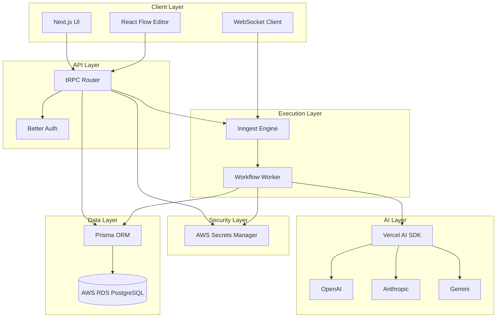
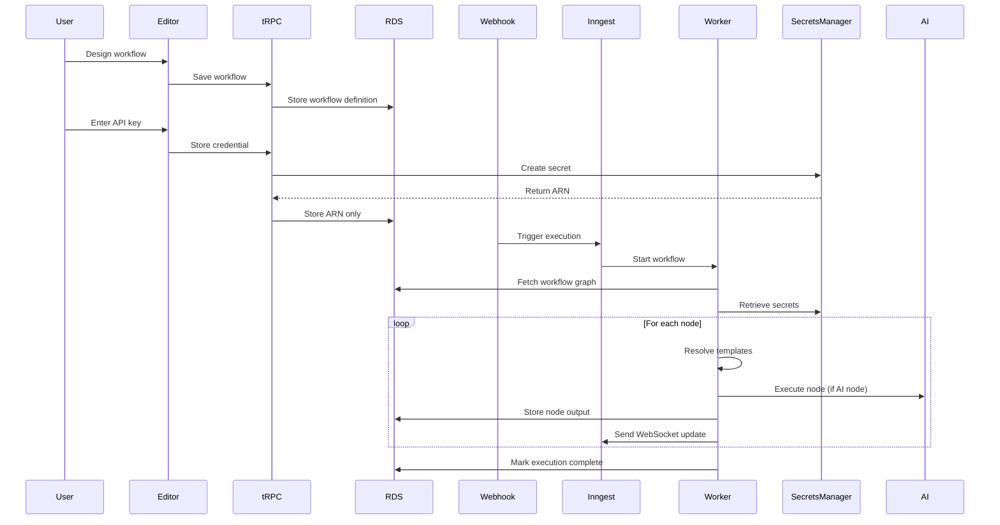

# Design Document: WorkFuse

## Overview

WorkFuse is an AI-native workflow automation platform built on AWS with a modern TypeScript stack. The architecture follows a three-phase model: Design (visual workflow creation), Storage (secure credential management), and Execution (durable workflow processing).

The system is composed of:
- **Frontend Layer**: Next.js application with React Flow for visual editing, Jotai for state management, and WebSocket for real-time updates
- **API Layer**: tRPC endpoints for type-safe client-server communication
- **Data Layer**: Prisma ORM with PostgreSQL (AWS RDS) for workflow definitions and execution history
- **Security Layer**: AWS Secrets Manager for credential storage, Better Auth for authentication
- **Execution Layer**: Inngest for durable workflow orchestration with no timeout limits
- **AI Layer**: Vercel AI SDK for multi-provider LLM integration (OpenAI, Anthropic, Gemini)

The design prioritizes security (zero-trust credential model), reliability (durable execution with retries), and developer experience (AI-powered configuration, real-time observability).

## Architecture

### System Architecture Diagram



### Execution Flow



## Components and Interfaces

### 1. Workflow Editor Component

**Responsibility**: Visual workflow design interface using React Flow

**Key Interfaces**:

```typescript
interface WorkflowGraph {
  id: string;
  name: string;
  nodes: WorkflowNode[];
  edges: WorkflowEdge[];
  version: number;
  createdAt: Date;
  updatedAt: Date;
}

interface WorkflowNode {
  id: string;
  type: NodeType;
  position: { x: number; y: number };
  data: NodeConfiguration;
}

interface WorkflowEdge {
  id: string;
  source: string;
  target: string;
  sourceHandle?: string;
  targetHandle?: string;
}

type NodeType = 'http' | 'transform' | 'condition' | 'ai' | 'trigger';

interface NodeConfiguration {
  label: string;
  config: Record<string, unknown>;
  retryPolicy?: RetryPolicy;
}

interface RetryPolicy {
  maxAttempts: number;
  backoffMultiplier: number;
  initialDelayMs: number;
}
```

**Operations**:
- `addNode(type: NodeType, position: Position): WorkflowNode`
- `deleteNode(nodeId: string): void`
- `addEdge(source: string, target: string): WorkflowEdge`
- `deleteEdge(edgeId: string): void`
- `updateNodeConfig(nodeId: string, config: NodeConfiguration): void`
- `validateGraph(graph: WorkflowGraph): ValidationResult`
- `saveWorkflow(graph: WorkflowGraph): Promise<void>`
- `loadWorkflow(workflowId: string): Promise<WorkflowGraph>`

**Validation Rules**:
- Graph must be a directed acyclic graph (DAG)
- All edges must connect existing nodes
- Each workflow must have exactly one trigger node
- Node configurations must match their type schema

### 2. Magic Input Component

**Responsibility**: AI-powered conversion of plain English to node configuration

**Key Interfaces**:

```typescript
interface MagicInputRequest {
  prompt: string;
  nodeType: NodeType;
  provider: AIProvider;
  context?: Record<string, unknown>;
}

interface MagicInputResponse {
  config: NodeConfiguration;
  confidence: number;
  reasoning?: string;
}

type AIProvider = 'openai' | 'anthropic' | 'gemini';

interface AIProviderConfig {
  provider: AIProvider;
  model: string;
  temperature: number;
  maxTokens: number;
}
```

**Operations**:
- `generateConfig(request: MagicInputRequest): Promise<MagicInputResponse>`
- `validateGeneratedConfig(config: NodeConfiguration, schema: JSONSchema): ValidationResult`
- `retryWithFeedback(request: MagicInputRequest, error: string, attempt: number): Promise<MagicInputResponse>`

**AI Prompt Strategy**:
- System prompt includes node type schema and examples
- User prompt includes plain English description and available context
- Response format enforced via JSON schema mode
- Retry mechanism includes previous error in context

### 3. Secret Manager Service

**Responsibility**: Secure credential storage and retrieval via AWS Secrets Manager

**Key Interfaces**:

```typescript
interface SecretReference {
  arn: string;
  name: string;
  createdAt: Date;
}

interface SecretValue {
  value: string;
  metadata?: Record<string, string>;
}

interface CreateSecretRequest {
  name: string;
  value: string;
  description?: string;
  tags?: Record<string, string>;
}
```

**Operations**:
- `createSecret(request: CreateSecretRequest): Promise<SecretReference>`
- `getSecretValue(arn: string): Promise<SecretValue>`
- `deleteSecret(arn: string): Promise<void>`
- `rotateSecret(arn: string, newValue: string): Promise<void>`

**Security Considerations**:
- All secrets encrypted at rest by AWS
- TLS for all API calls to Secrets Manager
- IAM role-based access control
- Secrets never logged or stored in application database
- Automatic secret rotation support

### 4. Execution Engine (Inngest Integration)

**Responsibility**: Durable workflow execution with state persistence

**Key Interfaces**:

```typescript
interface ExecutionContext {
  executionId: string;
  workflowId: string;
  trigger: TriggerPayload;
  nodeOutputs: Map<string, unknown>;
  secrets: Map<string, string>;
  startedAt: Date;
  status: ExecutionStatus;
}

type ExecutionStatus = 'pending' | 'running' | 'completed' | 'failed' | 'retrying';

interface TriggerPayload {
  source: string;
  data: Record<string, unknown>;
  headers?: Record<string, string>;
}

interface NodeExecutionResult {
  nodeId: string;
  status: 'success' | 'failure';
  output?: unknown;
  error?: ExecutionError;
  duration: number;
}

interface ExecutionError {
  message: string;
  code: string;
  stack?: string;
  retryable: boolean;
}
```

**Operations**:
- `startExecution(workflowId: string, trigger: TriggerPayload): Promise<string>`
- `executeNode(node: WorkflowNode, context: ExecutionContext): Promise<NodeExecutionResult>`
- `resolveTemplates(config: NodeConfiguration, context: ExecutionContext): NodeConfiguration`
- `retryNode(node: WorkflowNode, context: ExecutionContext, attempt: number): Promise<NodeExecutionResult>`
- `sendWebSocketUpdate(executionId: string, update: ExecutionUpdate): Promise<void>`

**Execution Algorithm**:
1. Fetch workflow graph from database
2. Perform topological sort to determine execution order
3. Retrieve all required secrets from AWS Secrets Manager
4. For each node in order:
   - Resolve template expressions using previous outputs
   - Execute node logic (HTTP call, transformation, AI request, etc.)
   - Store output in execution context
   - Send WebSocket update to client
   - If failure and retries configured, apply retry policy
5. Mark execution as completed or failed
6. Store final execution state in database

### 5. Template Engine

**Responsibility**: Dynamic data interpolation using Handlebars

**Key Interfaces**:

```typescript
interface TemplateContext {
  nodes: Record<string, unknown>;
  trigger: Record<string, unknown>;
  env: Record<string, string>;
}

interface TemplateHelpers {
  formatDate(date: string, format: string): string;
  jsonParse(json: string): unknown;
  jsonStringify(obj: unknown): string;
  uppercase(str: string): string;
  lowercase(str: string): string;
  get(obj: unknown, path: string): unknown;
}
```

**Operations**:
- `compile(template: string): CompiledTemplate`
- `render(template: CompiledTemplate, context: TemplateContext): string`
- `registerHelper(name: string, fn: Function): void`
- `validateTemplate(template: string): ValidationResult`

**Template Syntax**:
- Variable access: `{{nodes.node1.response.data}}`
- Nested access: `{{nodes.node1.user.email}}`
- Helper functions: `{{formatDate trigger.timestamp "YYYY-MM-DD"}}`
- Conditionals: `{{#if nodes.node1.success}}...{{/if}}`

### 6. Node Executors

**Responsibility**: Type-specific node execution logic

#### HTTP Node Executor

```typescript
interface HTTPNodeConfig {
  method: 'GET' | 'POST' | 'PUT' | 'DELETE' | 'PATCH';
  url: string;
  headers?: Record<string, string>;
  body?: unknown;
  auth?: {
    type: 'bearer' | 'basic' | 'apiKey';
    secretArn: string;
  };
  timeout?: number;
}

interface HTTPNodeOutput {
  status: number;
  headers: Record<string, string>;
  body: unknown;
  duration: number;
}
```

**Operations**:
- `execute(config: HTTPNodeConfig, context: ExecutionContext): Promise<HTTPNodeOutput>`
- `buildRequest(config: HTTPNodeConfig, secrets: Map<string, string>): Request`
- `handleResponse(response: Response): HTTPNodeOutput`

#### Transform Node Executor

```typescript
interface TransformNodeConfig {
  language: 'javascript' | 'jsonata';
  code: string;
  timeout?: number;
}

interface TransformNodeOutput {
  result: unknown;
  logs?: string[];
}
```

**Operations**:
- `execute(config: TransformNodeConfig, context: ExecutionContext): Promise<TransformNodeOutput>`
- `createSandbox(context: ExecutionContext): Sandbox`
- `runInSandbox(code: string, sandbox: Sandbox): unknown`

#### AI Node Executor

```typescript
interface AINodeConfig {
  provider: AIProvider;
  model: string;
  prompt: string;
  systemPrompt?: string;
  temperature?: number;
  maxTokens?: number;
  stream?: boolean;
}

interface AINodeOutput {
  response: string;
  usage: {
    promptTokens: number;
    completionTokens: number;
    totalTokens: number;
  };
  model: string;
  finishReason: string;
}
```

**Operations**:
- `execute(config: AINodeConfig, context: ExecutionContext): Promise<AINodeOutput>`
- `streamResponse(config: AINodeConfig, context: ExecutionContext): AsyncIterator<string>`

#### Condition Node Executor

```typescript
interface ConditionNodeConfig {
  conditions: ConditionRule[];
  defaultBranch: string;
}

interface ConditionRule {
  field: string;
  operator: 'eq' | 'ne' | 'gt' | 'lt' | 'contains' | 'matches';
  value: unknown;
  branch: string;
}

interface ConditionNodeOutput {
  branch: string;
  matchedRule?: number;
}
```

**Operations**:
- `execute(config: ConditionNodeConfig, context: ExecutionContext): Promise<ConditionNodeOutput>`
- `evaluateCondition(rule: ConditionRule, context: ExecutionContext): boolean`

### 7. tRPC API Router

**Responsibility**: Type-safe API endpoints for client-server communication

**Key Procedures**:

```typescript
// Workflow procedures
workflows.create(input: CreateWorkflowInput): Promise<Workflow>
workflows.update(input: UpdateWorkflowInput): Promise<Workflow>
workflows.delete(workflowId: string): Promise<void>
workflows.get(workflowId: string): Promise<Workflow>
workflows.list(): Promise<Workflow[]>
workflows.export(workflowId: string): Promise<WorkflowExport>
workflows.import(data: WorkflowExport): Promise<Workflow>

// Execution procedures
executions.trigger(workflowId: string, payload: TriggerPayload): Promise<string>
executions.get(executionId: string): Promise<Execution>
executions.list(workflowId: string, filters: ExecutionFilters): Promise<Execution[]>
executions.retry(executionId: string): Promise<string>
executions.cancel(executionId: string): Promise<void>

// Secret procedures
secrets.create(input: CreateSecretInput): Promise<SecretReference>
secrets.delete(arn: string): Promise<void>
secrets.list(): Promise<SecretReference[]>

// AI procedures
ai.generateConfig(input: MagicInputRequest): Promise<MagicInputResponse>
ai.testPrompt(input: TestPromptInput): Promise<AINodeOutput>
```

**Middleware**:
- Authentication: Validate session token on all requests
- Authorization: Verify user owns requested resources
- Rate limiting: Prevent abuse of AI endpoints
- Error handling: Transform errors to client-friendly format
- Logging: Record all API calls with timing

### 8. WebSocket Manager

**Responsibility**: Real-time execution updates to connected clients

**Key Interfaces**:

```typescript
interface ExecutionUpdate {
  executionId: string;
  type: UpdateType;
  nodeId?: string;
  data: unknown;
  timestamp: Date;
}

type UpdateType = 'started' | 'node_started' | 'node_completed' | 'node_failed' | 'completed' | 'failed';

interface WebSocketConnection {
  connectionId: string;
  userId: string;
  executionId: string;
  connectedAt: Date;
}
```

**Operations**:
- `connect(userId: string, executionId: string): Promise<string>`
- `disconnect(connectionId: string): Promise<void>`
- `sendUpdate(executionId: string, update: ExecutionUpdate): Promise<void>`
- `broadcast(userIds: string[], update: ExecutionUpdate): Promise<void>`

**Connection Management**:
- Authenticate WebSocket connections using session token
- Track active connections per execution
- Handle reconnection with execution state sync
- Clean up stale connections after timeout

## Data Models

### Database Schema (Prisma)

```prisma
model User {
  id        String   @id @default(cuid())
  email     String   @unique
  name      String?
  createdAt DateTime @default(now())
  updatedAt DateTime @updatedAt
  
  workflows  Workflow[]
  executions Execution[]
  sessions   Session[]
}

model Workflow {
  id          String   @id @default(cuid())
  name        String
  description String?
  graph       Json     // WorkflowGraph
  version     Int      @default(1)
  webhookUrl  String   @unique
  isActive    Boolean  @default(true)
  createdAt   DateTime @default(now())
  updatedAt   DateTime @updatedAt
  
  userId      String
  user        User     @relation(fields: [userId], references: [id], onDelete: Cascade)
  
  executions  Execution[]
  versions    WorkflowVersion[]
  secrets     SecretReference[]
  
  @@index([userId])
  @@index([webhookUrl])
}

model WorkflowVersion {
  id         String   @id @default(cuid())
  version    Int
  graph      Json
  createdAt  DateTime @default(now())
  
  workflowId String
  workflow   Workflow @relation(fields: [workflowId], references: [id], onDelete: Cascade)
  
  @@unique([workflowId, version])
  @@index([workflowId])
}

model Execution {
  id          String          @id @default(cuid())
  status      ExecutionStatus
  triggerData Json
  nodeResults Json            // Map<nodeId, NodeExecutionResult>
  error       String?
  startedAt   DateTime        @default(now())
  completedAt DateTime?
  duration    Int?            // milliseconds
  
  workflowId  String
  workflow    Workflow        @relation(fields: [workflowId], references: [id], onDelete: Cascade)
  
  userId      String
  user        User            @relation(fields: [userId], references: [id], onDelete: Cascade)
  
  logs        ExecutionLog[]
  
  @@index([workflowId])
  @@index([userId])
  @@index([status])
  @@index([startedAt])
}

enum ExecutionStatus {
  PENDING
  RUNNING
  COMPLETED
  FAILED
  RETRYING
  CANCELLED
}

model ExecutionLog {
  id          String   @id @default(cuid())
  nodeId      String
  level       LogLevel
  message     String
  data        Json?
  timestamp   DateTime @default(now())
  
  executionId String
  execution   Execution @relation(fields: [executionId], references: [id], onDelete: Cascade)
  
  @@index([executionId])
  @@index([timestamp])
}

enum LogLevel {
  DEBUG
  INFO
  WARN
  ERROR
}

model SecretReference {
  id          String   @id @default(cuid())
  name        String
  arn         String   @unique
  description String?
  createdAt   DateTime @default(now())
  
  workflowId  String
  workflow    Workflow @relation(fields: [workflowId], references: [id], onDelete: Cascade)
  
  @@index([workflowId])
}

model Session {
  id        String   @id @default(cuid())
  token     String   @unique
  expiresAt DateTime
  createdAt DateTime @default(now())
  
  userId    String
  user      User     @relation(fields: [userId], references: [id], onDelete: Cascade)
  
  @@index([userId])
  @@index([token])
}
```

### State Management (Jotai)

```typescript
// Workflow editor state
const workflowAtom = atom<WorkflowGraph | null>(null);
const selectedNodeAtom = atom<string | null>(null);
const isDirtyAtom = atom<boolean>(false);
const validationErrorsAtom = atom<ValidationError[]>([]);

// Execution state
const activeExecutionAtom = atom<string | null>(null);
const executionUpdatesAtom = atom<ExecutionUpdate[]>([]);
const executionStatusAtom = atom<ExecutionStatus>('pending');

// UI state
const sidebarOpenAtom = atom<boolean>(true);
const magicInputOpenAtom = atom<boolean>(false);
const selectedAIProviderAtom = atom<AIProvider>('openai');
```


## Correctness Properties

*A property is a characteristic or behavior that should hold true across all valid executions of a system—essentially, a formal statement about what the system should do. Properties serve as the bridge between human-readable specifications and machine-verifiable correctness guarantees.*

### Property Reflection

After analyzing all acceptance criteria, I identified the following redundancies:
- Requirements 1.5 and 1.6 both test workflow persistence round-trip - combined into single property
- Requirements 6.2, 6.3, 6.4 all test WebSocket updates for different node states - combined into comprehensive property
- Requirements 11.1, 11.2, 11.3, 11.4 all test retry behavior - combined into comprehensive retry property

### Core Workflow Properties

**Property 1: Node addition increases graph size**
*For any* workflow graph and node type, adding a node should result in a graph with exactly one more node than before.
**Validates: Requirements 1.2**

**Property 2: Valid connections preserve DAG structure**
*For any* workflow graph and two nodes, connecting them should either succeed (if no cycle created) or fail with validation error (if cycle would be created).
**Validates: Requirements 1.3**

**Property 3: Node deletion removes all edges**
*For any* workflow graph and node with connections, deleting the node should result in a graph where no edges reference that node's ID.
**Validates: Requirements 1.4**

**Property 4: Workflow persistence round-trip**
*For any* valid workflow graph, saving it to the database then loading it should produce an equivalent graph with identical nodes, edges, and configurations.
**Validates: Requirements 1.5, 1.6**

### AI Configuration Properties

**Property 5: AI-generated configs are schema-valid**
*For any* AI provider response that successfully parses, the resulting node configuration should pass schema validation for the target node type.
**Validates: Requirements 2.2, 2.4**

**Property 6: Invalid AI responses trigger retries**
*For any* AI provider response that fails JSON parsing, the system should retry up to 3 times before failing permanently.
**Validates: Requirements 2.3**

### Security Properties

**Property 7: Credential storage returns valid ARN**
*For any* credential string, storing it in Secret Manager should return a valid AWS ARN format string.
**Validates: Requirements 3.1**

**Property 8: Database contains only ARNs, never credentials**
*For any* workflow stored in the database, all credential fields should contain only ARN strings matching AWS ARN format, never raw credential values.
**Validates: Requirements 3.2**

**Property 9: Credential round-trip via ARN**
*For any* credential string, storing it, receiving an ARN, then retrieving by that ARN should return the original credential value.
**Validates: Requirements 3.3**

**Property 10: Workflow deletion cascades to secrets**
*For any* workflow with associated secrets, deleting the workflow should result in all associated secrets being deleted from Secret Manager.
**Validates: Requirements 3.6**

### Execution Engine Properties

**Property 11: Webhook triggers create executions**
*For any* valid webhook payload sent to a workflow's webhook URL, an execution record should be created in the database with status "pending" or "running".
**Validates: Requirements 4.1, 12.2**

**Property 12: Nodes execute in topological order**
*For any* valid workflow DAG, the execution order of nodes should satisfy topological ordering constraints (all dependencies execute before dependents).
**Validates: Requirements 4.2**

**Property 13: Node outputs persist to context**
*For any* node that completes successfully, its output should be stored in the execution context and accessible to subsequent nodes.
**Validates: Requirements 4.3**

**Property 14: Retry policy is respected**
*For any* node with a retry policy that fails, the system should retry according to the policy (exponential backoff, max attempts) and mark as failed only after exhausting all retries.
**Validates: Requirements 4.4, 11.1, 11.2, 11.3, 11.4**

**Property 15: Execution resumption from interruption**
*For any* execution that is interrupted mid-workflow, resuming it should continue from the last successfully completed node, not re-execute completed nodes.
**Validates: Requirements 4.6**

### Template Engine Properties

**Property 16: Valid templates resolve correctly**
*For any* template expression with valid variable references, resolving it against an execution context containing those variables should produce the expected interpolated string.
**Validates: Requirements 5.2**

**Property 17: All previous outputs are accessible**
*For any* execution context with N completed nodes, templates should be able to reference outputs from all N nodes using the syntax `{{nodes.nodeId.field}}`.
**Validates: Requirements 5.3**

**Property 18: Invalid template references fail**
*For any* template expression referencing a non-existent variable, resolution should fail with a descriptive error indicating which variable was not found.
**Validates: Requirements 5.4**

**Property 19: Nested object access works**
*For any* execution context with nested object outputs, templates should be able to access deeply nested properties using dot notation (e.g., `{{nodes.node1.response.data.items[0].id}}`).
**Validates: Requirements 5.5**

**Property 20: Template helpers transform correctly**
*For any* supported helper function (formatDate, jsonParse, uppercase, etc.), applying it in a template should produce the correct transformation of the input.
**Validates: Requirements 5.6**

### Observability Properties

**Property 21: Node execution sends WebSocket updates**
*For any* node execution (start, complete, or failure), a corresponding WebSocket update should be sent with the correct event type and node data.
**Validates: Requirements 6.2, 6.3, 6.4**

**Property 22: Executions persist to database**
*For any* workflow execution, a record should be created in the database containing status, timestamps, node results, and any errors.
**Validates: Requirements 6.5, 13.1**

**Property 23: Node data is stored**
*For any* node execution, the system should store the node's inputs, outputs, and any error messages in the execution record.
**Validates: Requirements 13.4**

### AI Provider Properties

**Property 24: AI requests route to selected provider**
*For any* AI node configured with a specific provider (OpenAI, Anthropic, Gemini), the execution should send the request to that provider's API endpoint.
**Validates: Requirements 7.3**

**Property 25: AI failures trigger exponential backoff**
*For any* AI provider request that fails, subsequent retries should use exponentially increasing delays (e.g., 1s, 2s, 4s, 8s).
**Validates: Requirements 7.4**

**Property 26: AI usage metrics are tracked**
*For any* AI node execution, the system should record usage metrics including token counts, estimated cost, and latency.
**Validates: Requirements 7.5**

### Versioning Properties

**Property 27: Saves increment version number**
*For any* workflow that is saved, the version number should increase by exactly 1 from the previous version.
**Validates: Requirements 8.3**

**Property 28: Previous versions are restorable**
*For any* workflow version stored in the database, restoring it should recreate the workflow graph exactly as it was at that version.
**Validates: Requirements 8.4**

**Property 29: Invalid workflows are rejected**
*For any* workflow graph that violates structural rules (cycles, disconnected nodes, missing trigger), saving should fail with validation errors.
**Validates: Requirements 8.5**

### Authentication Properties

**Property 30: Login produces valid session token**
*For any* successful user login, the system should issue a session token that passes validation checks and has a future expiration time.
**Validates: Requirements 9.2**

**Property 31: Invalid tokens are rejected**
*For any* tRPC request with an invalid or expired session token, the request should be rejected with an authentication error.
**Validates: Requirements 9.3**

**Property 32: Users cannot access others' workflows**
*For any* user attempting to access a workflow, the request should succeed only if the workflow belongs to that user.
**Validates: Requirements 9.5**

**Property 33: Role permissions are enforced**
*For any* user with a specific role (viewer, editor, admin), operations should be allowed or denied according to the role's permission set.
**Validates: Requirements 9.6**

### Node Type Properties

**Property 34: Node configs validate against type schemas**
*For any* node configuration and node type, validation should pass only if the configuration matches the type's JSON schema.
**Validates: Requirements 10.6**

### Retry Properties

**Property 35: Retry attempts are logged**
*For any* node that retries, each retry attempt should create a log entry with timestamp, attempt number, and error message.
**Validates: Requirements 11.5**

**Property 36: Failed executions can be manually retried**
*For any* execution with status "failed", triggering a manual retry should create a new execution with the same workflow and trigger data.
**Validates: Requirements 11.6**

### Webhook Properties

**Property 37: Workflows get unique webhook URLs**
*For any* two workflows created in the system, their webhook URLs should be different.
**Validates: Requirements 12.1**

**Property 38: Webhook payload is available in context**
*For any* webhook trigger with payload data, that data should be accessible in the execution context under the `trigger` namespace.
**Validates: Requirements 12.3**

**Property 39: Invalid webhook signatures are rejected**
*For any* webhook configured with signature validation, requests with invalid signatures should be rejected before execution starts.
**Validates: Requirements 12.4**

**Property 40: Webhook responses include execution status**
*For any* webhook request, the HTTP response should include the execution ID and initial status.
**Validates: Requirements 12.5**

**Property 41: Webhook authentication methods work**
*For any* webhook configured with API key or HMAC authentication, requests without valid credentials should be rejected.
**Validates: Requirements 12.6**

### Query Properties

**Property 42: Execution filters return correct results**
*For any* execution query with filters (status, date range, workflow ID), all returned executions should match the filter criteria.
**Validates: Requirements 13.5**

### Import/Export Properties

**Property 43: Workflow export produces valid JSON**
*For any* workflow, exporting it should produce a JSON string that parses successfully and contains all workflow data.
**Validates: Requirements 14.1**

**Property 44: Exports exclude credentials**
*For any* workflow export, the resulting JSON should contain only ARN references, never raw credential values.
**Validates: Requirements 14.2**

**Property 45: Invalid imports are rejected**
*For any* import attempt with malformed JSON or missing required fields, the import should fail with validation errors.
**Validates: Requirements 14.3**

**Property 46: External formats are parsed correctly**
*For any* valid n8n or Zapier workflow JSON, importing it should produce a valid WorkFuse workflow with equivalent functionality.
**Validates: Requirements 14.5**

### Performance Properties

**Property 47: Rate limiting rejects excessive requests**
*For any* webhook endpoint, requests exceeding the rate limit threshold should be rejected with HTTP 429 status.
**Validates: Requirements 15.3**

**Property 48: Executions have performance metrics**
*For any* completed execution, the record should include performance metrics such as total duration, per-node duration, and resource usage.
**Validates: Requirements 15.6**

## Error Handling

### Error Categories

1. **Validation Errors**: Invalid workflow structure, node configuration, or template syntax
   - Return descriptive error messages with field-level details
   - HTTP 400 Bad Request for API calls
   - Display inline errors in UI

2. **Authentication Errors**: Invalid or expired session tokens
   - HTTP 401 Unauthorized
   - Redirect to login page
   - Clear local session state

3. **Authorization Errors**: User lacks permission for requested operation
   - HTTP 403 Forbidden
   - Display permission denied message

4. **Resource Not Found**: Workflow, execution, or secret doesn't exist
   - HTTP 404 Not Found
   - Suggest alternative actions (create new, view list)

5. **External Service Errors**: AWS Secrets Manager, AI providers, webhook targets
   - Implement retry with exponential backoff
   - Log detailed error information
   - Return user-friendly error messages
   - Mark execution as failed after retries exhausted

6. **Execution Errors**: Node failures, template resolution errors, timeout
   - Store error details in execution record
   - Send WebSocket update with error
   - Respect retry policy if configured
   - Allow manual retry

7. **Database Errors**: Connection failures, constraint violations, deadlocks
   - Retry transient errors automatically
   - Log error details for debugging
   - Return generic error to user (don't expose DB details)

### Error Response Format

```typescript
interface ErrorResponse {
  code: string;
  message: string;
  details?: Record<string, unknown>;
  retryable: boolean;
  timestamp: Date;
}
```

### Retry Strategies

**Exponential Backoff**:
- Initial delay: 1 second
- Multiplier: 2x
- Max delay: 60 seconds
- Max attempts: configurable per node (default 3)
- Jitter: ±20% to prevent thundering herd

**Retryable Errors**:
- Network timeouts
- HTTP 429 (rate limit)
- HTTP 500, 502, 503, 504 (server errors)
- AWS Secrets Manager throttling
- AI provider rate limits

**Non-Retryable Errors**:
- HTTP 400 (bad request)
- HTTP 401 (unauthorized)
- HTTP 403 (forbidden)
- HTTP 404 (not found)
- Validation errors
- Template syntax errors

## Testing Strategy

### Dual Testing Approach

WorkFuse requires both unit tests and property-based tests for comprehensive coverage:

**Unit Tests**: Focus on specific examples, edge cases, and integration points
- Test specific node type executors with known inputs/outputs
- Test error conditions (invalid JSON, missing secrets, network failures)
- Test UI component rendering and interactions
- Test tRPC procedure logic with mocked dependencies
- Test database queries and mutations
- Test WebSocket connection handling

**Property-Based Tests**: Verify universal properties across all inputs
- Test workflow graph operations (add/delete nodes, validate DAG)
- Test template engine with random expressions and contexts
- Test retry logic with various failure scenarios
- Test credential round-trip through Secret Manager
- Test execution ordering with random DAGs
- Test import/export with generated workflows
- Test authentication and authorization with random users/roles

### Property-Based Testing Configuration

**Library**: Use `fast-check` for TypeScript property-based testing

**Configuration**:
- Minimum 100 iterations per property test
- Seed-based reproducibility for failed tests
- Shrinking enabled to find minimal failing cases
- Timeout: 30 seconds per property

**Test Tagging**: Each property test must include a comment referencing the design property:
```typescript
// Feature: workfuse, Property 4: Workflow persistence round-trip
test('workflow save/load round-trip preserves structure', async () => {
  await fc.assert(
    fc.asyncProperty(workflowGraphArbitrary, async (graph) => {
      const saved = await saveWorkflow(graph);
      const loaded = await loadWorkflow(saved.id);
      expect(loaded).toEqual(graph);
    }),
    { numRuns: 100 }
  );
});
```

### Test Organization

```
tests/
├── unit/
│   ├── components/
│   │   ├── workflow-editor.test.tsx
│   │   ├── magic-input.test.tsx
│   │   └── node-config-form.test.tsx
│   ├── api/
│   │   ├── workflows.test.ts
│   │   ├── executions.test.ts
│   │   └── secrets.test.ts
│   ├── executors/
│   │   ├── http-node.test.ts
│   │   ├── transform-node.test.ts
│   │   ├── ai-node.test.ts
│   │   └── condition-node.test.ts
│   └── services/
│       ├── secret-manager.test.ts
│       ├── template-engine.test.ts
│       └── websocket-manager.test.ts
├── property/
│   ├── workflow-graph.property.test.ts
│   ├── template-engine.property.test.ts
│   ├── execution-engine.property.test.ts
│   ├── credential-security.property.test.ts
│   ├── retry-logic.property.test.ts
│   └── import-export.property.test.ts
├── integration/
│   ├── end-to-end-workflow.test.ts
│   ├── webhook-trigger.test.ts
│   └── ai-configuration.test.ts
└── arbitraries/
    ├── workflow-graph.ts
    ├── node-config.ts
    ├── execution-context.ts
    └── template-expressions.ts
```

### Key Test Scenarios

**Workflow Editor**:
- Create workflow with multiple node types
- Connect nodes and validate DAG
- Delete nodes and verify edge cleanup
- Save and load workflow
- Export and import workflow

**Magic Input**:
- Generate HTTP node config from "fetch user data from GitHub API"
- Generate transform node config from "extract email addresses"
- Handle AI provider failures gracefully
- Validate generated configs against schemas

**Execution Engine**:
- Execute linear workflow (A → B → C)
- Execute branching workflow with conditions
- Execute workflow with failing node and retries
- Resume interrupted execution
- Handle template resolution errors

**Security**:
- Store and retrieve credentials via Secret Manager
- Verify database never contains raw credentials
- Test webhook signature validation
- Test role-based access control

**Real-time Updates**:
- Verify WebSocket updates for each node state
- Test reconnection after connection drop
- Verify execution history persistence

### Mocking Strategy

**External Services**:
- Mock AWS Secrets Manager SDK for unit tests
- Mock Vercel AI SDK for AI provider tests
- Mock Inngest client for execution tests
- Use test database for integration tests

**Test Data**:
- Generate realistic workflow graphs with fast-check
- Use factory functions for common test objects
- Seed database with known test data for integration tests

### CI/CD Integration

- Run unit tests on every commit
- Run property tests on every PR
- Run integration tests before deployment
- Collect coverage metrics (target: 80%+ for critical paths)
- Fail build on test failures or coverage drops
